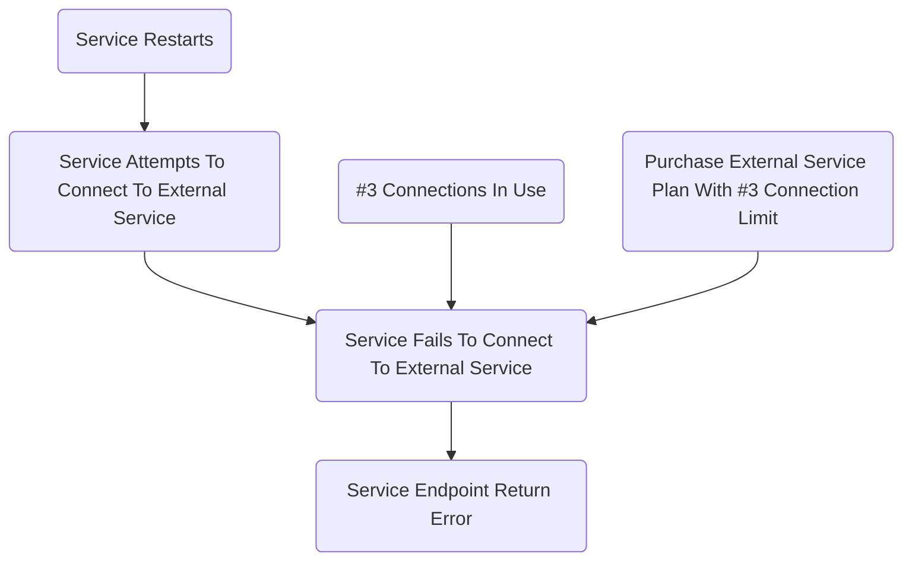

+++
author = "James Moriarty"
title = "Causal Diagrams"
date = "2022-05-18"
description = ""
tags = [
  "sre",
  "diagram"
]
+++

Incidents often result from contributing factors as opposed to a singular root cause. As a result, causal diagrams can be an effective tool for illustrating incidents.

## Example

From the above example we can derive how the incident might have been avoided:

* The purchased plan supported a higher number of connections.
* Less existing connection were in use.
* The service wasn't restarted.

## Tips

* Causal diagrams should consist of a list of linked events that contributed to the incident.
* These events should be things that happened as opposed to the absence of something.
