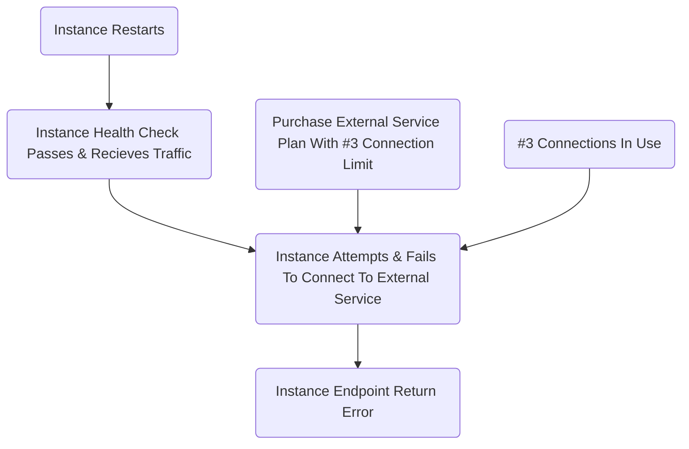

+++
author = "James Moriarty"
title = "Causal Diagrams"
date = "2022-05-18"
description = ""
tags = [
  "sre",
  "diagram"
]
+++

Incidents often result from contributing factors as opposed to a singular root cause. As a result, causal diagrams can be an effective tool for illustrating incidents.

## Example

This is an example of an incident impacting availability of a service endpoint:

Tips: Causal diagrams should consist of a list of linked events that contributed to the incident. These events should be things that happened as opposed to the absence of something.

## Insight

From the above example we can derive the incident might have been avoided if:

Removed a contribnuting factor:
* Less connections were in use.
* The plan supported a higher number of connections.

Broke a link in a sequence:
* The service wasn't restarted.
* The health check didn't pass allowing the instance to recieve traffic.

