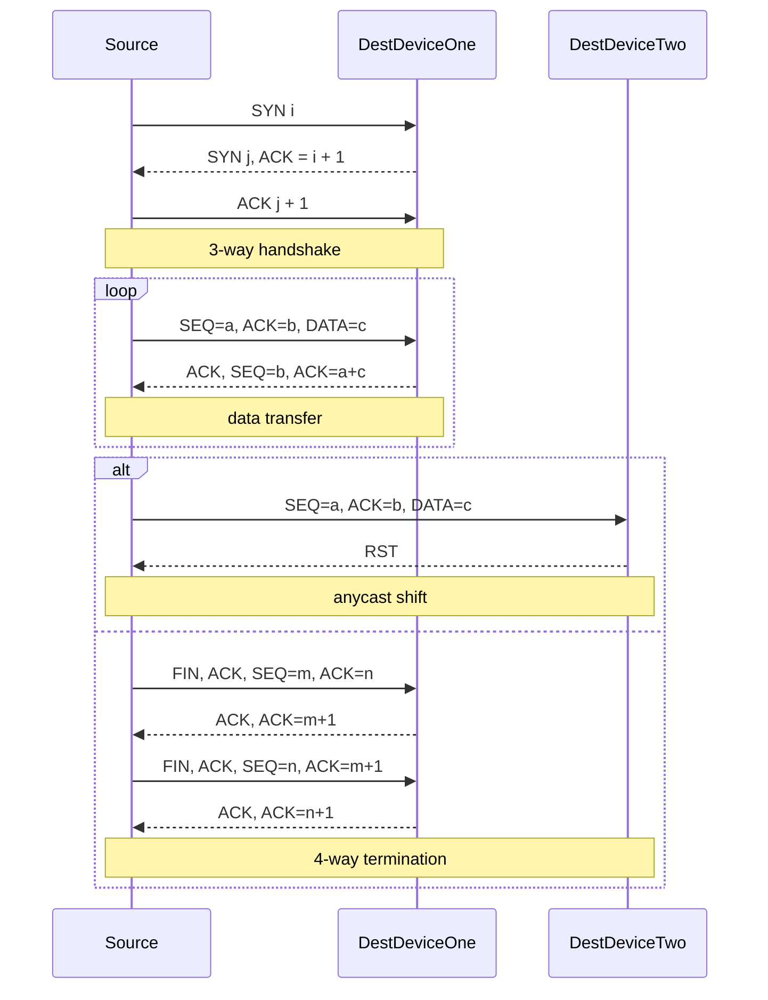

+++
author = "James Moriarty"
title = "TCP Anycast Shift"
date = "2022-04-10"
description = ""
tags = [
  "tcp",
  "anycast"
]
+++

What happens when routing changes for a stateful network protocol and messages arrives at another device?

## Terminology

* TCP is a stateful network protocol.
* Anycast is a network addressing and routing method in which devices share a single destination IP address.
* Equal-cost multipath is a mechanism to increase bandwidth using parallel links.

## Symptoms

`tcpdump` from the source illustrates the different behaviours when accessing the destination via regular and anycast IP address. The regular returned the expected flags `[S][.][P.]...[F.]` while anycast returned `[S][.][P.]...[R]`. Where ` [S] (Start Connection)`, `[P] (Push Data)`, `[R] (Reset Connection)`, and `[F] (Finish Connection)`. Connection reset was reproducible with:

* Specific origins.
* Larger payloads.
* Persistent connections.

## Explanation

Take the following interaction diagram illustrating the above:

I’ve included lots of details in the following interaction diagram to help illustrate the stateful nature. Lets focus on “anycast shift” where packets arrives at a device without an established session. We experience this from origins with routes utilizing [equal-cost multipath](https://www.noction.com/blog/equal-cost-multipath-ecmp).
