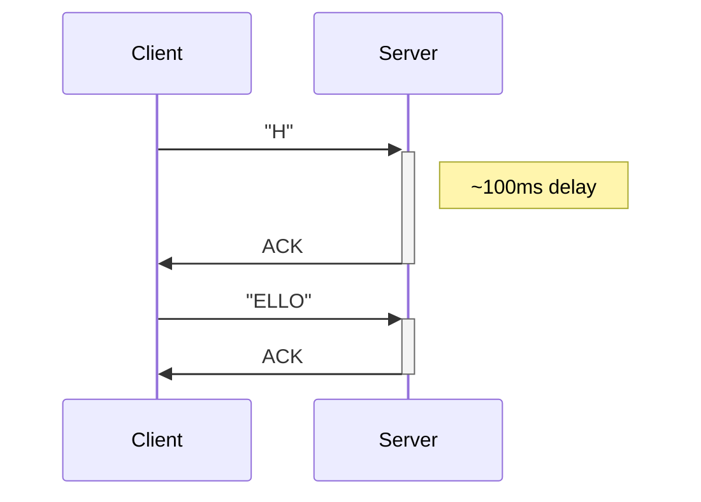
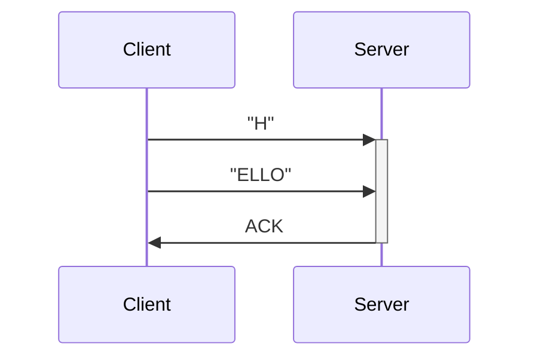

+++
author = "James Moriarty"
title = "TCP Nagle's Delay"
date = "2022-04-12"
description = ""
aliases = ["TCP Delayed ACK"]
tags = [
  "tcp",
  "nodelay",
  "nagle"
]
+++

Someone recently asked me to help diagnose a mysterious delay on a globally deployed Elixir service.

## Symptoms

* ~100 millisecond delay without TLS.
* ~20 millisecond response from the upstream.
* The delay could not be reproduced with other client types.

## Explanation

The client configuration appeared correct e.g. `nodelay: true`. Further investigation revealed the configuration paramaters weren't being honored. We managed to trace it to this [client defect](https://github.com/elixir-grpc/grpc/issues/176). This resulted in the following condition:

> [Nagle's] algorithm interacts badly with TCP delayed acknowledgments (delayed ACK), a feature introduced into TCP at roughly the same time in the early 1980s, but by a different group. With both algorithms enabled, applications that do two successive writes to a TCP connection, followed by a read that will not be fulfilled until after the data from the second write has reached the destination, experience a constant delay of up to 500 milliseconds, the "ACK delay". It is recommended to disable either, although traditionally it's easier to disable Nagle, since such a switch already exists for real-time applications.

[―Wikipedia](https://en.wikipedia.org/wiki/Nagle%27s_algorithm)

## Diagram

With Nagle's algorithm e.g. without `TCP_NODELAY`

Without Nagle's algorithm e.g. with `TCP_NODELAY`

N.B. I have previously helped facilitate SRE training for this [scenario](https://github.com/jvns/twine-stories/blob/main/50ms-request.twee#L2). This is the first time I've caught it in the wild.
